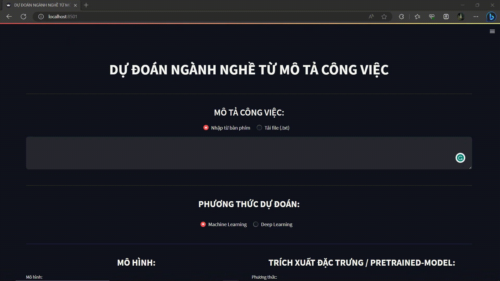

# Multi-label Classification of Job Descriptions for Vietnamese job sites

## Task description

The task of classifying job descriptions into industries is a text classification task. To predict industries we are using information in the job description such as knowledge, skills, interest, etc. However, that is the multi-label classification task because the job description will often have one or more corresponding industries that are most relevant. 
- __Input__: Text containing the content of the job description.
- __Output__: One or more industries that are most relevant.

Here is my demo app using `streamlit`:

## Dataset

### Data Collection
I collect data from two of the most popular online job search sites in Vietnam:
- [Vietnamworks](https://www.vietnamworks.com/)
- [TopCV](https://www.topcv.vn/)

The data we have collected includes the job description, the job's requirements, and the industries directly related to the job. For more details please read [my report](reports/reports.pdf).

Here is my example data:

| job_description     | job_requirements | industries |
|---------------|------|------------------------------|
| Báo cáo cho: CEO 1. Hỗ trợ tổng giám đốc xây dựng chiến lược kinh doanh tổng thể và tổ chức thực hiện, đồng thời thực hiện các mục tiêu và kế hoạch kinh doanh cụ thể. 2. Tiến hành theo dõi phát triển thị trường và điều chỉnh chiến lược theo từng giai đoạn. 3. Tổ chức thu thập thông tin thị trường, phân tích, nghiên cứu chuyên sâu và đề xuất định hướng, cải tiến hoạt động của thị trường. 4. Phát triển khách hàng, giới thiệu sản phẩm của công ty với khách hàng, giải thích chính sách công ty cho khách hàng. 5. Theo dõi và thiết lập mối quan hệ tốt với khách hàng để tạo thuận lợi cho giao dịch và hoàn thành các chỉ tiêu kinh doanh. 6. Chịu trách nhiệm lựa chọn, đào tạo, triển khai và kiểm tra, đánh giá hiệu suất của nhân viên kinh doanh. 7. Phối hợp tốt với các phòng ban khác hoàn thành các công việc khác do cấp trên giao phó. | 1. Trình độ học vấn  - Tốt nghiệp cao đẳng trở lên các chuyên ngành liên quan  2. Kinh nghiệm làm việc  - Có kinh nghiệm tối thiểu 05 năm trở lên ở vị trí tương đương, ưu tiên từng làm việc cho doanh nghiệp liên quan lĩnh vực bán lẻ, công nghệ.  3. Kiến thức/ Năng lực chuyên môn/ Kỹ năng  - Sử dụng tốt các phần mềm văn phòng  - Kỹ năng đàm phán, giao dịch với khách hàng, đối tác. - Giao tiếp được tiếng Anh hoặc tiếng Trung  4. Năng lực cốt lõi  - Có tố chất, tư duy và khả năng xử lý công việc; dẫn dắt đội nhóm  - Chịu được áp lực công việc cường độ cao | Kinh doanh, Quản lý điều hành |
| - Làm việc tại văn phòng không đi thị trường  - Khai thác nguồn khách hàng có sẵn của công ty.  - Tư vấn làm hồ sơ vay tín chấp cho khách hàng.  - Tiếp nhận, hoàn thành hồ sơ vay, hướng dẫn thủ tục giải ngân cho khách hàng.  - Báo cáo kết quả công việc hàng tuần/ tháng  Thời gian làm việc: Giờ hành chính từ (8h30 - 17h30) Từ Thứ Hai đến Sáng Thứ Bảy (chiều Thứ Bảy, Chủ Nhật nghỉ)  Địa điểm làm việc: Toà nhà Pico Plaza, số 20 Cộng Hoà, Phường 12, Quận Tân Bình, TP Hồ Chí Minh. |  - Tuổi từ 18 đến 35 tuổi.  - Không yêu cầu kinh nghiệm, sẽ được đào tạo, nếu đã có kinh nghiệm sẽ là một lợi thế.  - Phù hợp với sinh viên mới ra trường muốn thử sức môi trường làm việc chuyên nghiệp.  - Ưu tiên UV có kinh nghiệm tài chính, ngân hàng, kinh doanh, bảo hiểm, BĐS, nhân viên bán hàng, NVKD  - Ưu tiên ứng viên muốn gắn bó và làm việc cùng team lâu dài  - Chỉ tuyển Fulltime- Không tuyển thực tập - CTV | IT Phần mềm, Hành chính - Thư ký, Tư vấn, Ngân hàng |

### Data Pre-processing
- Step 1: Remove all samples that are in English.
- Step 2: Lowercase.
- Step 3: Tokenization using [VNCoreNLP](https://github.com/vncorenlp/VnCoreNLP)
- Step 4: Punctuation removal.
- Step 5: [Vietnamese stopwords](https://github.com/stopwords/vietnamese-stopwords) removal.

### Data Splitting
- For training: 70%.
- For validation: 10%.
- For test: 20%.

## Approach

### Models
- Machine Learning: Linear Regression, SGD, SVM.
- Deep Learning: MLP, TextCNN, Bi-LSTM, Bi-GRU.

### Feature Extraction
- Machine Learning: TF-IDF, fastText, GloVe.
- Deep Learning: phoBERT, XLMBERT, distilBERT.

## Evaluation
Measurement we use:
- Precision, recall and f1-score (Weighted & Samples).
- Hamming score.
- Exact Match Ratio.

After a series of experiments, we have the results that the combined fine-tuning model using XLMBERT and Bi-GRU gives the best results with `Haming score`, `EM ratio`, `F1-score` of __0.57__, __0.38__ and __0.64__, respectively. For more details on experimental results and my error analysis please read [my report](reports/reports.pdf).

## Usage
Because the file size is too large, I can not upload data, and trained models. If you are interested feel free to contact me.

### Prerequisite:
- Must install JRE or JDK >= 1.8
- Python 3.6+

### Instructions
- Step 1: `pip install virtualenv`
- Step 2: `virtualenv env`
- Step 3: `env\Scripts\activate`
- Step 3: `pip install -r requirements.txt`
- Step 4: `streamlit run main.py`

## References
- [Job Prediction: From Deep Neural Network Models to Applications](https://arxiv.org/pdf/1912.12214.pdf)
- [Predicting Job Titles from Job Descriptions with Multi-label Text Classification](https://arxiv.org/abs/2112.11052)